# ZZU_auto_jksb

[](https://github.com/Yann-zhou/zzu_auto_jksb/actions/workflows/build_docker_image.yml)


## 一、项目简介

该项目可以帮助你自动进行每日健康上报，项目使用python作为后台，只需简单配置即可自动运行，已添加docker与GitHub Actions支持  
如果有可以长时间开机的服务器或者可以使用docker的软路由或树莓派，**强烈建议**您使用docker模式进行打卡，学校后台会记录打卡机器的IP地址，如果使用GitHub Actions的话，IP地址会显示在国外，使用docker就不会有这个问题了。

**如果觉得本项目不错的话，请watch本项目及时获取更新**

---
### 更新日志

- 2022.09.09 打卡系统删除了验证码
- 2022.09.07 打卡系统验证码变更为了手写汉字，增加对应的手写汉字识别功能
- 2022.09.06 打卡系统添加汉语验证码，添加汉语大写数字识别功能
- 2022.09.04 打卡系统添加了验证码，使用百度云API进行在线识别，[百度云API获取教程](#2)

---

## 二、使用方法
### 1. 直接调用原始文件
(1) 将以下值加入系统环境变量
```
jksb_username           健康上报系统中的用户名
jksb_password           健康上报系统中的密码
jksb_code_province      当前所在省份代码（河南为41）
jksb_code_city          当前所在城市代码（郑州为4101）
jksb_location           当前所在地详细地址
jksb_vaccine            疫苗接种情况
jksb_jingdu             当前所在地经度
jksb_weidu              当前所在地纬度
jksb_send_type          后续通知方法类型（可选bark,serverchan,email）
jksb_send_parameter     根据send_type进行选择，
                        send_type为bark时，该项为推送URL，
                        send_type为serverchan时，该项为SCT开头的sendkey
                        send_type为email时，该项格式为：{"host": "smtp服务器地址", "user": "邮箱登录名", "password": "邮箱密码", "receiver": "接收邮件的邮箱"}
jksb_baidu_API_Key      百度手写文字识别APIKey
jksb_baidu_Secret_Key   百度手写文字识别SecretKey
jksb_zhb_parameter      （已被打卡系统废弃）郑好办核酸检测查询抓包内容，留空则默认将“昨天是否进行过核酸检测”项填写为“做了”
jksb_logger_level       （可选）日志等级
```
参数填写规则请参考[参数填写详细规则](#1)

(2) 调用jksb.py中的run方法即可运行

### 2. 使用docker容器
本项目已构建完成amd64与适用于树莓派4B的armv8架构的docker镜像，使用以下命令可以启动docker容器

参数填写规则请参考[参数填写详细规则](#1)
```bash
docker run -d -e jksb_username=学号 \
              -e jksb_password=密码 \
              -e jksb_code_province=省份代码 \
              -e jksb_code_city=城市代码 \
              -e jksb_location=位置信息 \
              -e jksb_vaccine=疫苗情况 \
              -e jksb_jingdu=所在地经度 \
              -e jksb_weidu=所在地纬度 \
              -e jksb_send_type=通知类型 \
              -e jksb_send_parameter=通知参数 \
              -e jksb_timer=运行时间 \
              -e jksb_baidu_API_Key=百度手写文字识别APIKey \
              -e jksb_baidu_Secret_Key=百度手写文字识别SecretKey \
              yannzhou/zzu_auto_jksb:latest
```
如您想自己构建docker镜像：

本仓库内已集成dockerfile，在仓库根目录执行以下命令即可自动构建docker镜像
```bash
docker build -t 镜像名:版本号 .
```
> 注意命令最后有一个点

构建完成后，按照“直接调用原始文件”部分提到的参数列表在docker的运行命令内或yaml文件内加入相应的环境变量即可

### 3. 使用GitHub Actions
本仓库内已集成GitHub Actions配置文件，您只需Fork本仓库后配置以下Secrets即可在每日0点5分、1点5分、7点5分进行自动打卡

参数填写规则请参考[参数填写详细规则](#1)
```
jksb_username: 学号
jksb_password: 密码
jksb_code_province: 省份代码
jksb_code_city: 城市代码
jksb_location: 具体地址
jksb_vaccine: 疫苗情况
jksb_jingdu: 经度
jksb_weidu: 纬度
jksb_send_type: 通知类型
jksb_send_parameter: 通知参数
jksb_baidu_API_Key:      百度手写文字识别APIKey
jksb_baidu_Secret_Key:   百度手写文字识别SecretKey
zhb_parameter: （已被打卡系统废弃）郑好办查询参数
```
---

#### GitHub Actions配置教程
1. 首先fork本项目
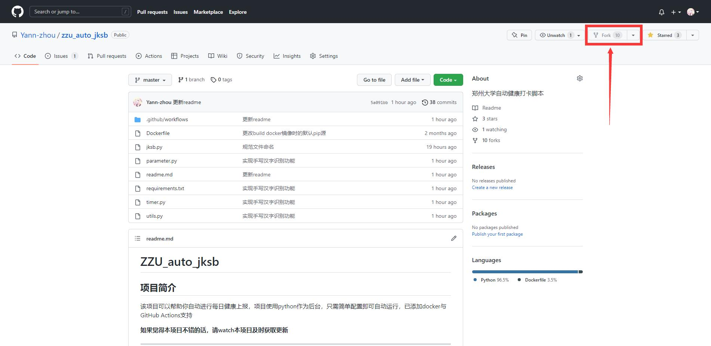
2. 确认fork操作
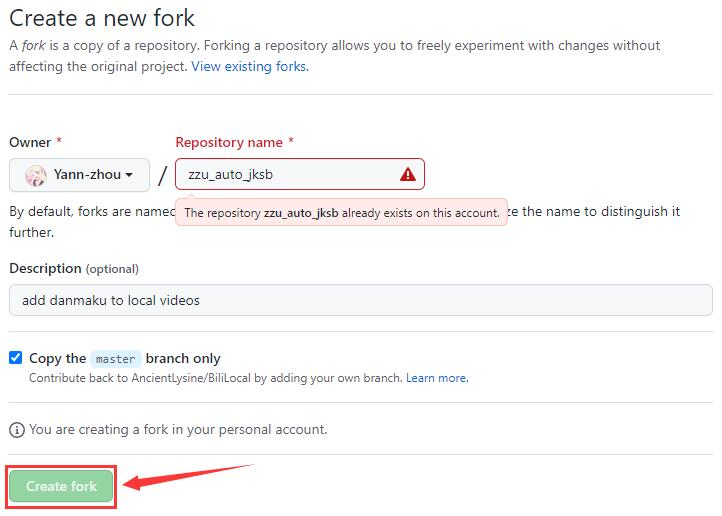
3. 添加secret
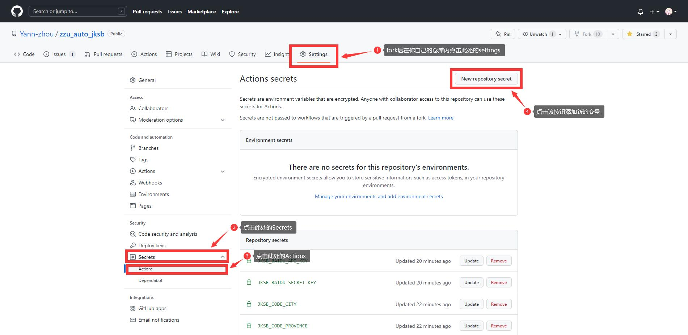
4. 重复执行该步骤直到所有变量均已添加
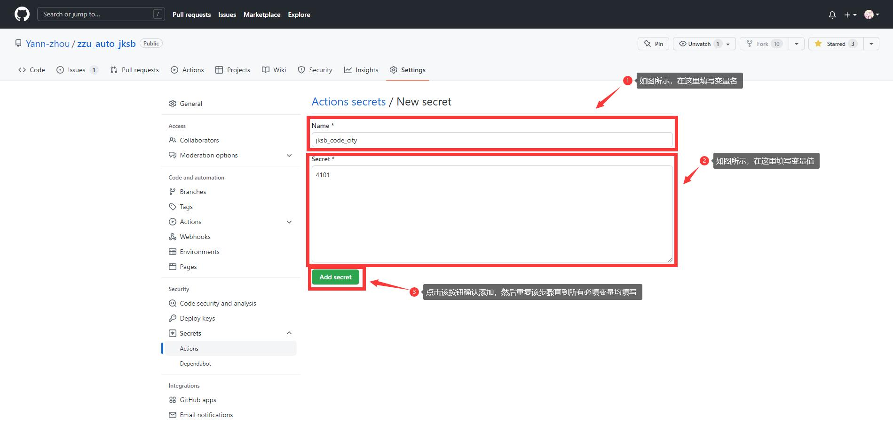
5. 最终添加后的结果
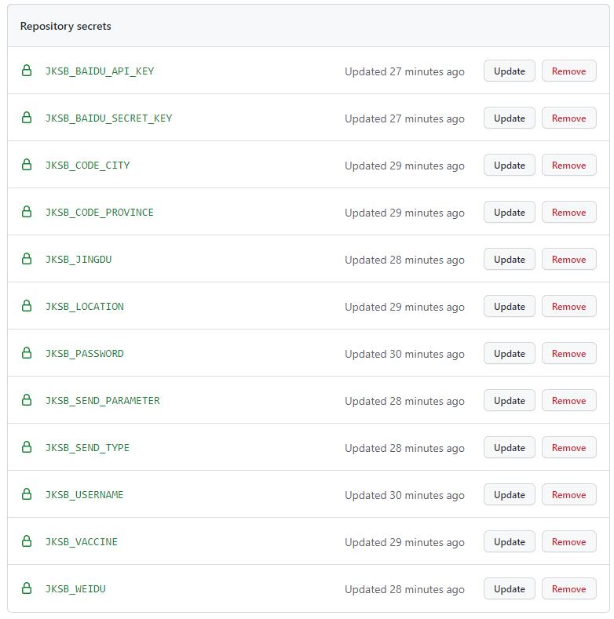

#### 查看GitHub Actions日志
1. 打开Actions页面
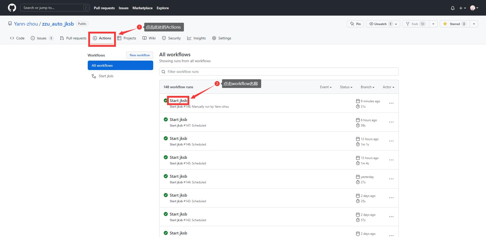
2. 打开具体的job
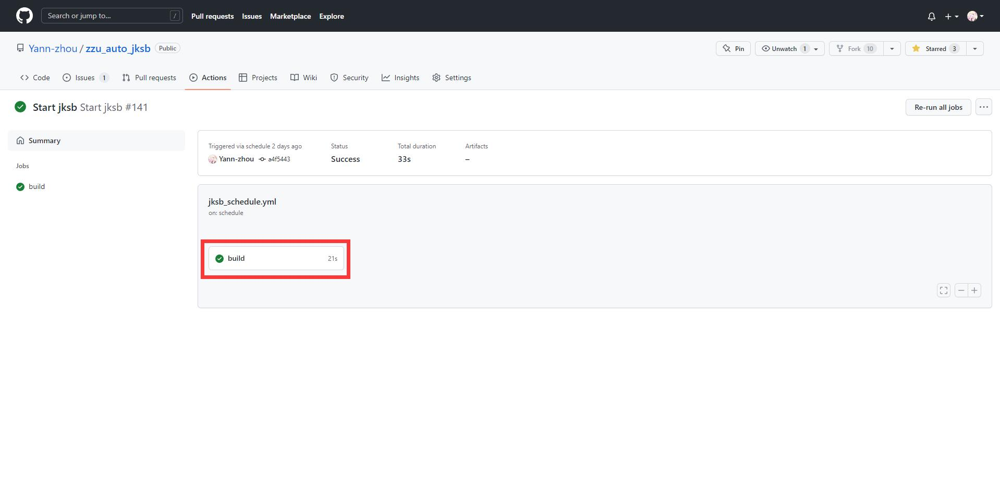
3. 打开详细日志
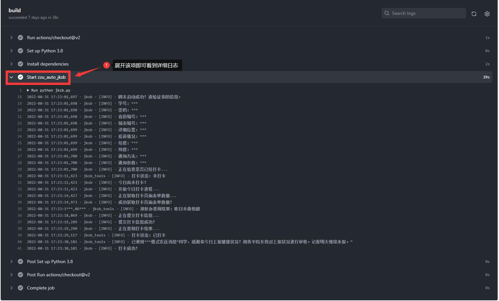

---

<div id="1"></div>

## 参数填写详细规则
- jksb_username: 学号
- jksb_password: 密码
- jksb_code_province：所在地身份证号编码的前两位  
- jksb_code_city：所在地身份证号编码的前四位  
（例如人在河南郑州就是jksb_code_province=41，jksb_code_city=4101）  
- jksb_location：填写实际地址
- jksb_vaccine：按照以下情况填写数字1~5  
(1: 接种一针，2: 接种两针，3:尚未接种，4:有禁忌症无法接种，5:接种三针)  
- jksb_jingdu与jksb_weidu：在这个网站中拾取经纬度后填入即可：https://jingweidu.bmcx.com/
- jksb_send_type：共有三种：{email, serverchan, bark}，配置该参数的目的是在打卡完成后给您发送通知，请尽量使用serverchan方式进行通知，出错概率较低。
- jksb_send_parameter：与上一项搭配使用。  
send_type为bark与serverchan时，该项为推送URL，  
send_type为serverchan时，该项为SCT开头的sendkey  
send_type为email时，该项格式为：{"host": "smtp服务器地址", "user": "邮箱登录名", "password": "邮箱密码", "receiver": "接收邮件的邮箱"}  
*例如当您使用sereverchan模式时，jksb_send_type=serverchan, jksb_send_parameter=SCTxxxxxxxxxxxxxxxxxxxxxxxxxxxxxx*  
*当您使用email模式时，jksb_send_type=email, jksb_send_parameter={"host": "smtp.163.com", "user": "example@163.com, "password": "yourPassword", "receiver": "example@163.com"}*
- ~~zhb_parameter相关参数：默认情况下，脚本会将核酸检测情况填写为“做了”，如您想自动采集核酸检测信息，请使用fiddler抓取您使用手机扫描任一场所码时对URL `https://unified-area-code-n-service.jianguan.henan.gov.cn/nucleicapi/nucvac/info` 发送的请求中"param"项的参数填到此处即可。~~
- jksb_baidu_API_Key：百度手写文字识别APIKey  
  jksb_baidu_Secret_Key：百度手写文字识别SecretKey


---
<div id="2"></div>

#### 百度云API获取教程
1. 注册并登录百度智能云平台<https://cloud.baidu.com/>，按照网页要求进行实名认证
2. 打开手写文字识别应用页面<https://cloud.baidu.com/product/ocr_others/handwriting>，点击页面上方的“立即使用”
3. 领取百度云手写识别免费API资源
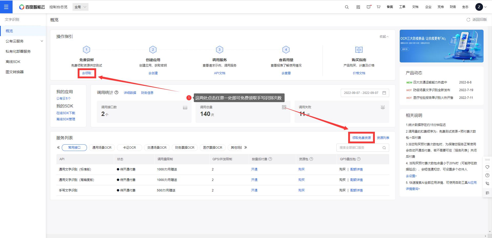
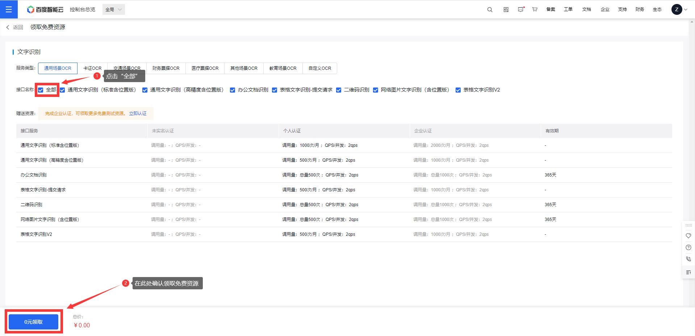
4. 创建OCR应用
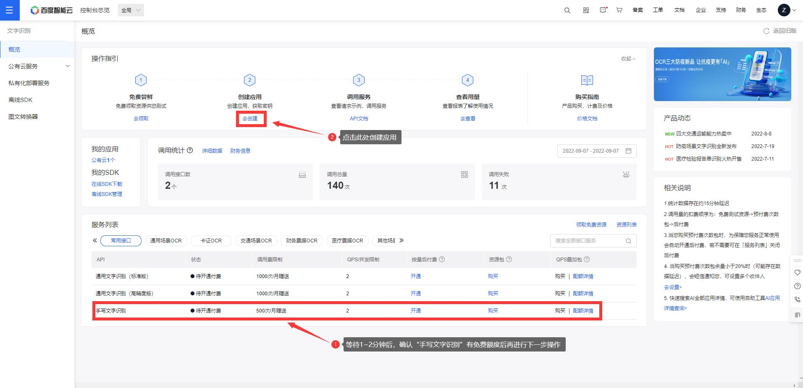
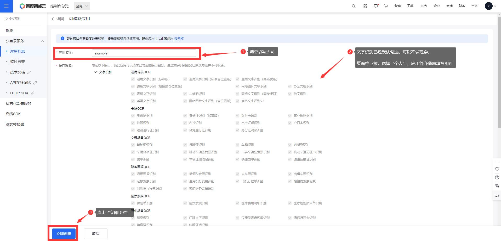
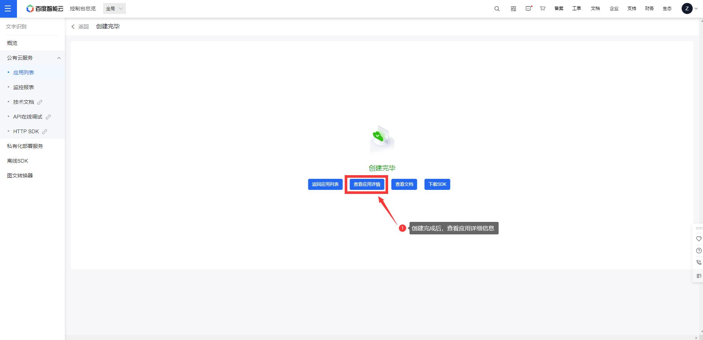
5. 复制API Key与Secret Key
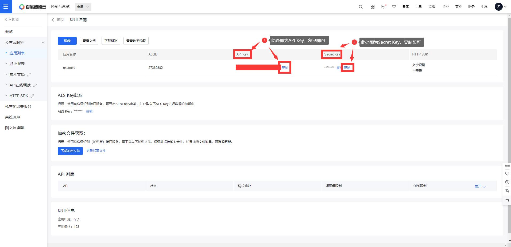
---

## 三、待添加功能
- [x] 自动采集郑好办核酸检测信息(不稳定)
- [x] docker支持
- [x] Github Actions支持
- [x] 验证码识别
- [x] 汉字验证码识别
- [x] 手写汉字验证码识别